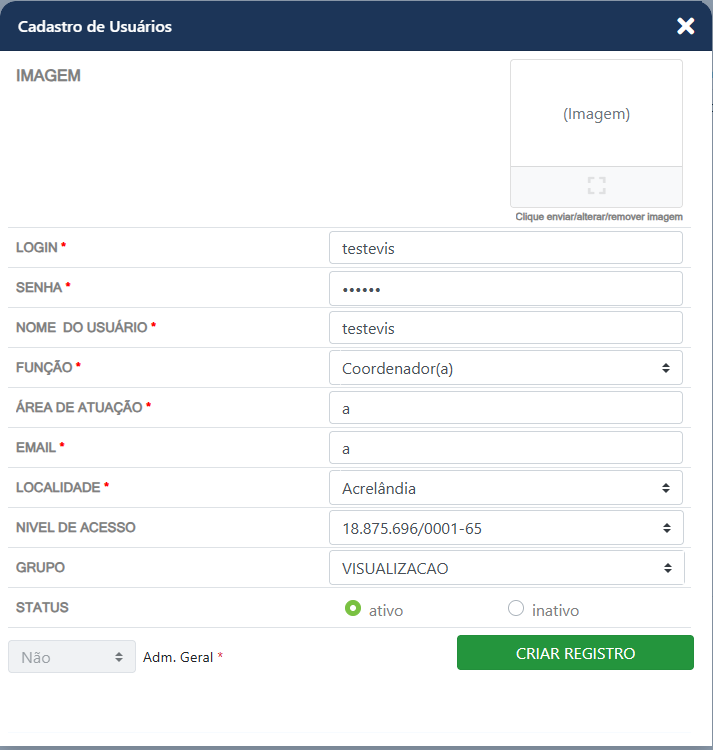
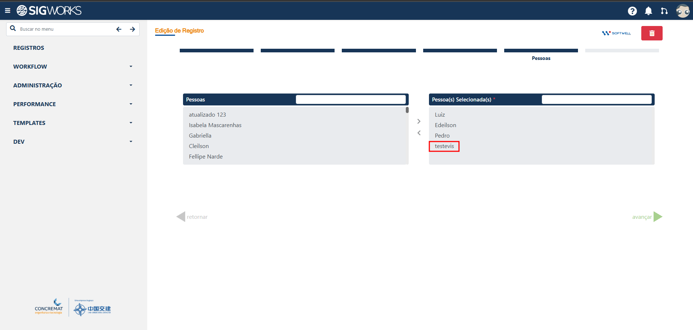
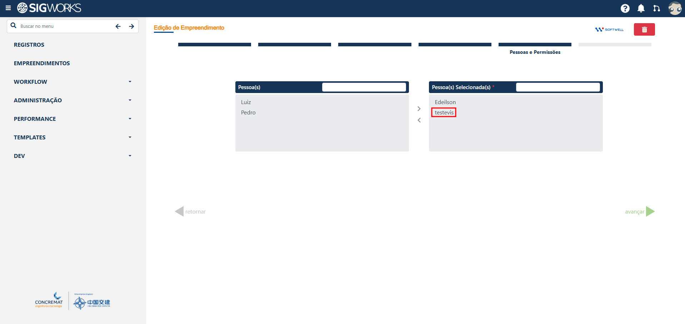
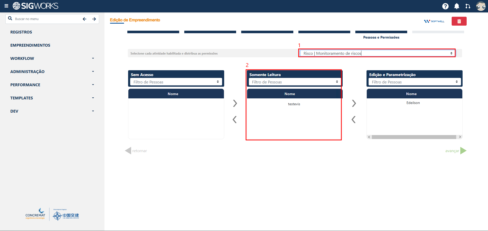

# Manual de Uso

Cadastro e configuração de um usuário com acesso exclusivo à visualização de informações do sistema.

> Introduzido na **v1.60**

## Cadastro do usuário

Para utilizar o acesso de visualização, inicialmente deve ser realizado o cadastro do usuário no sistema.

Durante o cadastro, o usuário deverá ser associado ao grupo **Visualização**. Essa configuração é responsável por definir que o usuário terá acesso destinado à consulta das informações, sem permissões para realizar cadastros ou alterações nos dados.

## Adição do usuário como participante do registro

Após o cadastro do usuário e sua associação ao grupo **Visualização**, é necessário adicioná-lo como participante do registro que ele deverá consultar.

No cadastro do registro, localize a área destinada aos participantes e adicione o usuário de visualização. Essa etapa é necessária para que o usuário tenha acesso aos dados relacionados ao registro.

## Adição do usuário como participante do empreendimento

Em seguida, o usuário também deverá ser adicionado como participante do empreendimento que ele poderá visualizar.

No cadastro do empreendimento, selecione o usuário na área destinada aos participantes. A associação ao empreendimento define quais informações estarão disponíveis para consulta pelo usuário.

## Definição dos módulos disponíveis

Apenas adicionar o usuário como participante do empreendimento não é suficiente para liberar a visualização dos dados. É necessário definir também quais módulos estarão disponíveis para esse usuário.

No final do cadastro do empreendimento, localize a seção destinada à seleção dos módulos e associe o usuário ao módulo que deverá ser disponibilizado.

Atualmente, o acesso de visualização está disponível para o módulo de **Administração de Risco**, incluindo suas **OPRs e dashboards**.

## Conclusão

Após realizar as quatro etapas, o usuário estará configurado para acessar as informações do empreendimento e do módulo selecionado exclusivamente para visualização, respeitando as permissões definidas para o grupo **Visualização**.
