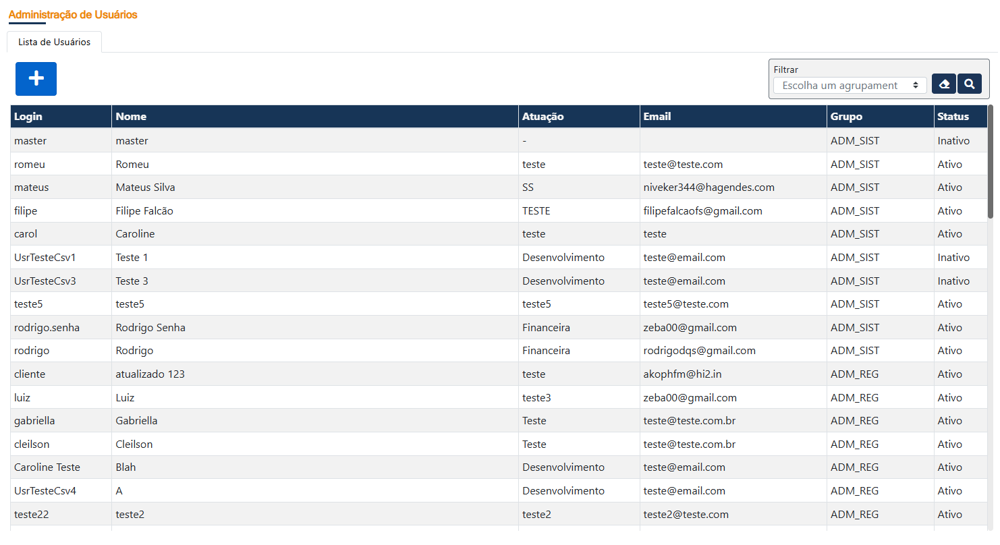
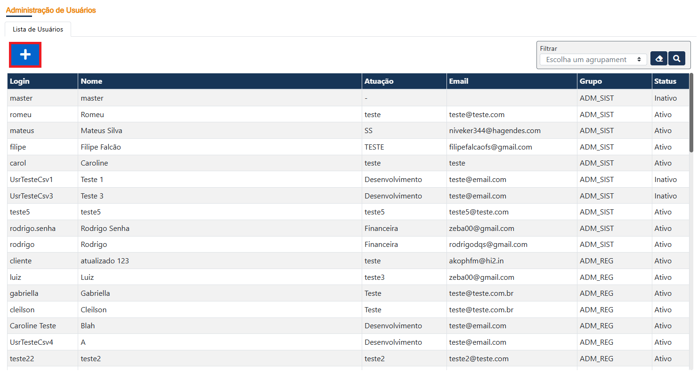
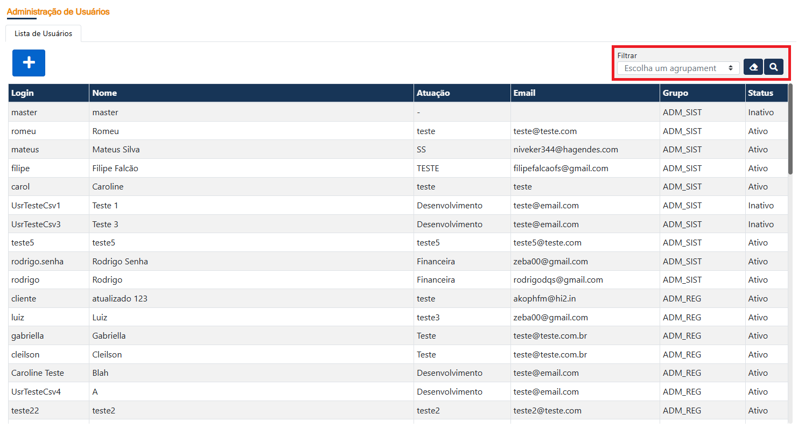
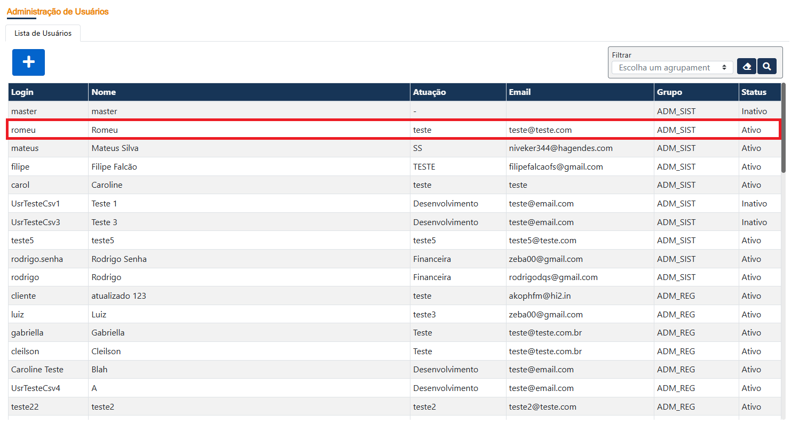

# Manual de Uso – Administração de Usuários

A tela de **Administração de Usuários** permite consultar os usuários cadastrados no sistema, adicionar novos usuários e acessar o formulário de edição dos registros existentes.

---

## Como utilizar

### 1. Lista de Usuários

Ao acessar a tela de **Administração de Usuários**, será apresentada a lista de usuários cadastrados.

A listagem apresenta as principais informações dos registros, como:

- **Login**;
- **Nome**;
- **Atuação**;
- **Email**;
- **Grupo**;
- **Status**.

---

### 2. Adicionar um novo usuário

Para cadastrar um novo usuário, utilize o botão com o símbolo **"+"**, localizado no canto superior esquerdo da tela.

Ao clicar no botão, o sistema direcionará para o fluxo de cadastro de um novo usuário.

> **Print sugerido:** inserir uma captura destacando o botão **"+"** utilizado para adicionar um novo usuário.

---

### 3. Filtrar registros

No canto superior direito da tela está disponível a opção de **Filtrar** registros.

O filtro pode ser utilizado para localizar informações de acordo com a coluna **Descrição**.

Para realizar um filtro:

1. Acesse a opção **Filtrar**;
2. Selecione o agrupamento desejado;
3. Informe ou selecione o valor utilizado para a pesquisa;
4. Execute a busca.

O recurso permite localizar registros específicos sem a necessidade de percorrer toda a listagem manualmente.

---

### 4. Acessar a edição de um usuário

Para visualizar ou editar os dados de um usuário existente, clique sobre a **linha correspondente ao usuário** na listagem.

Ao selecionar a linha, o sistema abrirá o **formulário de edição do usuário**, permitindo acessar os dados do registro selecionado.

---

## Resumo

| Ação | Localização |
| --- | --- |
| Adicionar usuário | Botão **"+"**, no canto superior esquerdo |
| Filtrar registros | Área **Filtrar**, no canto superior direito |
| Editar usuário | Clique sobre a linha do usuário na listagem |

